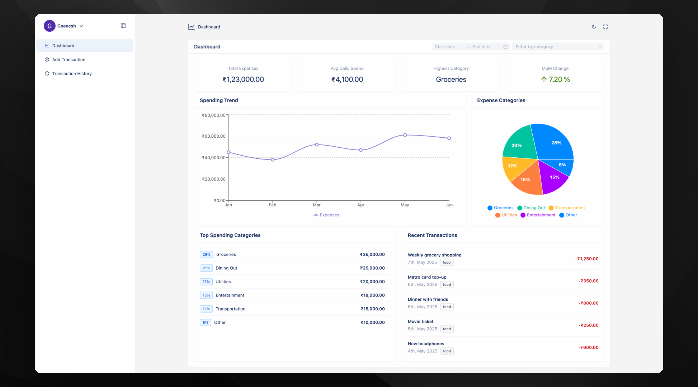
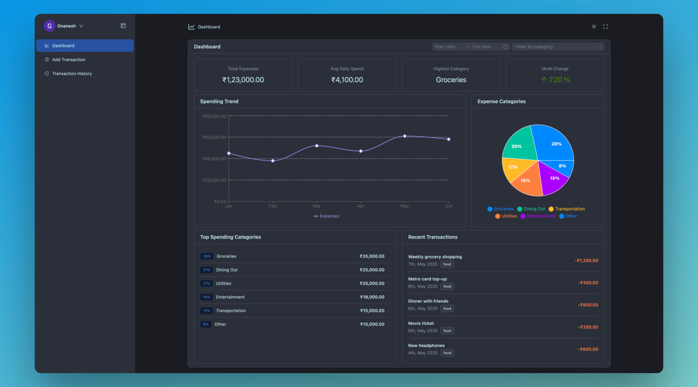
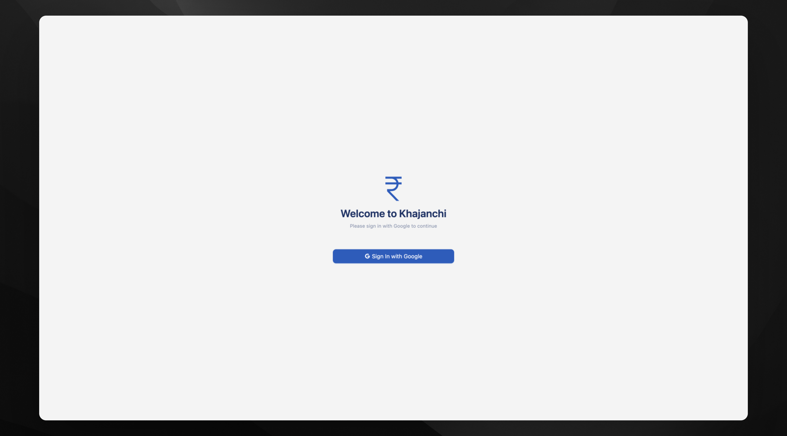
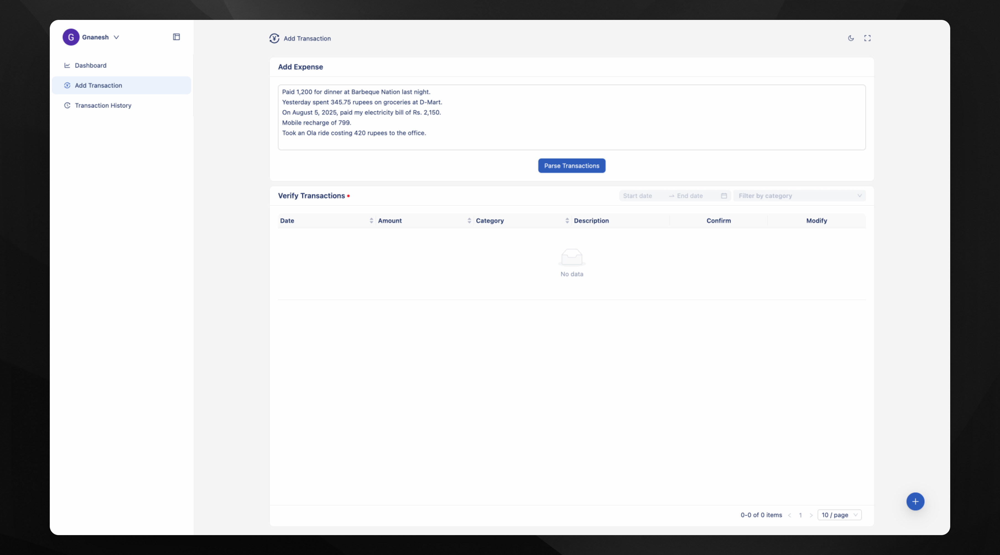
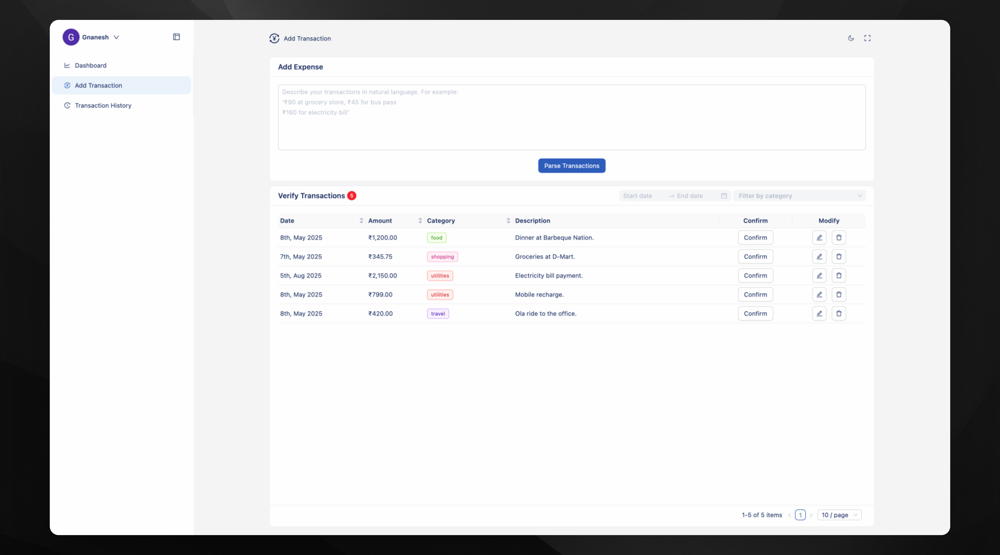
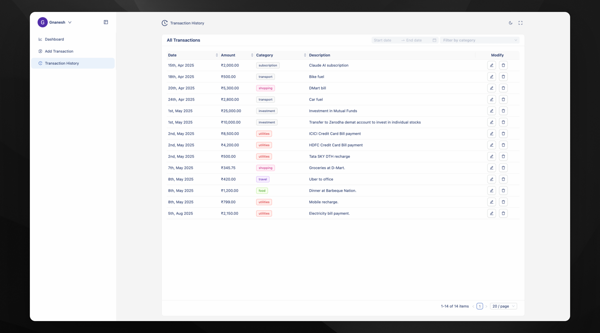
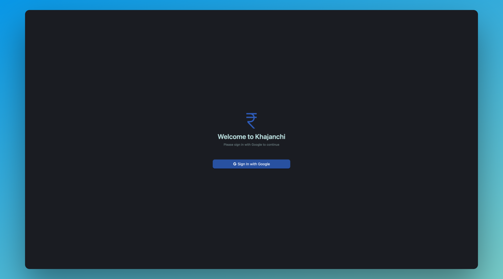
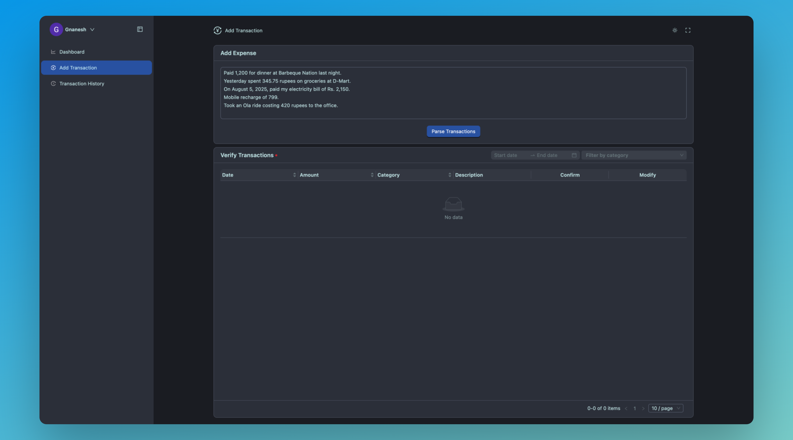
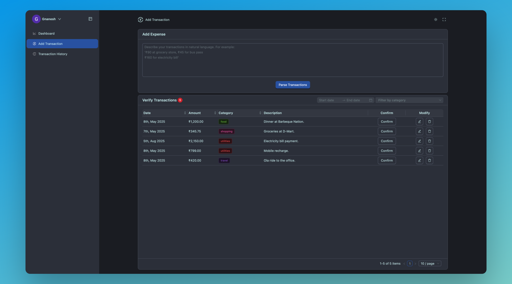
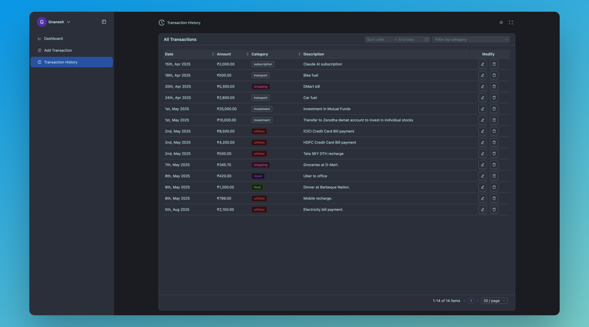

# Khajanchi - Simple Expense Tracker

A simple expense tracker inspired by [Gullak](https://github.com/mr-karan/gullak).

Enter your expenses in natural language, and let AI handle parsing and categorizing your transactions.

<div align="center">
  <p><strong>Khajanchi Dashboard (Light & Dark Theme)</strong></p>
  
  
</div>
<br/>

<details>
<summary><strong>More Application Screenshots (Light Theme)</strong></summary>
<p align="center">
  
  
  
  
</p>
</details>

<details>
<summary><strong>More Application Screenshots (Dark Theme)</strong></summary>
<p align="center">
  
  
  
  
</p>
</details>

> **Note:** This application is currently under active development. Features and configurations may change.

## Development Setup

### 1. Clone the Repository

```bash
git clone https://github.com/GnaneshPuttaswamy/khajanchi
cd khajanchi
```

### 2. Set Up Environment Variables

You'll need to create environment files for both the backend and frontend services. Examples are provided in their respective packages.

- **Backend:** Copy `packages/backend/.env.example` to `packages/backend/.env.development`.
  The `docker-compose.development.yml` is configured to use `packages/backend/.env.development`.
- **Frontend:** Copy `packages/frontend/.env.example` to `packages/frontend/.env`.
  The frontend service will use the standard `.env` file within its directory.

Below are the environment variables you'll find in the example files. Ensure you update them according to your setup, especially the placeholder values.

**Backend (`packages/backend/.env.development`):**

```env
# Application Configuration
PORT=3000 # Port the backend service will run on *inside* the container
NODE_ENV=development
JWT_SECRET=your_strong_jwt_secret # Change this to a strong, random secret

# Database Configuration (for connecting from the backend service to the DB container)
DB_USERNAME=khajanchi
DB_PASSWORD=khajanchi
DB_DATABASE=khajanchi
DB_HOST=khajanchi-db # Docker service name for the PostgreSQL database
DB_DIALECT=postgres
DB_PORT=5432 # Port the PostgreSQL database service listens on *inside* the Docker network

# Logger Configuration
LOG_LEVEL=silly # e.g., error, warn, info, http, verbose, debug, silly
LOG_FILE_PATH=logs/app.log

# OpenAI API Key (Mandatory for AI parsing features)
OPENAI_API_KEY=your_openai_api_key # Replace with your actual OpenAI API key

# Google OAuth Configuration (Mandatory for Google login)
GOOGLE_CLIENT_ID=your_google_client_id.apps.googleusercontent.com # Replace with your Google Client ID
GOOGLE_CLIENT_SECRET=your_google_client_secret # Replace with your Google Client Secret
```

**Frontend (`packages/frontend/.env`):**

```env
# API URL for the frontend to connect to the backend
VITE_API_URL=http://localhost:3001/api/v1 # This points to the backend service exposed on host port 3001

# Google OAuth Client ID (for frontend usage)
VITE_GOOGLE_CLIENT_ID=your_google_client_id.apps.googleusercontent.com # Replace with your Google Client ID (should be the same as used in backend)
```

**Important:**

- The `OPENAI_API_KEY` is crucial for the AI-powered transaction parsing.
- `GOOGLE_CLIENT_ID` and `GOOGLE_CLIENT_SECRET` are necessary for Google OAuth authentication. Make sure the `GOOGLE_CLIENT_ID` in the backend and `VITE_GOOGLE_CLIENT_ID` in the frontend are for the same Google Cloud project and OAuth client.

### 3. Start Services with Docker Compose

To start all services (backend, frontend, and database) for development:

```bash
docker compose -f docker-compose.development.yml up --build
```

- Using `-f docker-compose.development.yml` specifies the development compose file.
- `--build` ensures images are rebuilt if there are changes (e.g., in Dockerfiles or application code copied into the image).

This command performs the following:

- Starts a **PostgreSQL** database service (`khajanchi-db-development`):
  - Accessible from your host machine on port `5433` (maps to container port `5432`).
  - Data is persisted in a Docker volume named `khajanchi-db-data-development`.
- Starts the **backend API service** (`khajanchi-api-development`):
  - Accessible from your host machine on port `3001` (maps to container port `3000`).
  - Source code from `./packages/backend/src` is mounted into the container for live reloading.
  - Automatically runs database migrations (`db:migrate`) and seeds initial data (`db:seed:all`) upon starting.
- Starts the **frontend development server** (`khajanchi-web-development`):
  - Accessible from your host machine on port `5174` (maps to Vite's default port `5173` in the container).
  - Source code from `./packages/frontend` is mounted into the container for live reloading (HMR).

### 4. Access the Application

Once the services are up and running:

- **Frontend Application:** Navigate to [http://localhost:5174](http://localhost:5174) in your web browser.
- **Backend API Base URL:** [http://localhost:3001/api/v1](http://localhost:3001/api/v1) (e.g., for testing with tools like Postman).

## Todo

This project is under active development. Here are some of the key features and improvements planned as next steps.

- [ ] **Dashboard API Integration:**
  - Connect the frontend dashboard components to live backend APIs to display dynamic user data.
- [ ] **Production Docker Setup:**
  - Create robust `docker-compose.yml` and `Dockerfile` configurations optimized for production deployment.
- [ ] **CI/CD Pipeline:**
  - Implement a Continuous Integration/Continuous Deployment (CI/CD) pipeline (e.g., using GitHub Actions).
