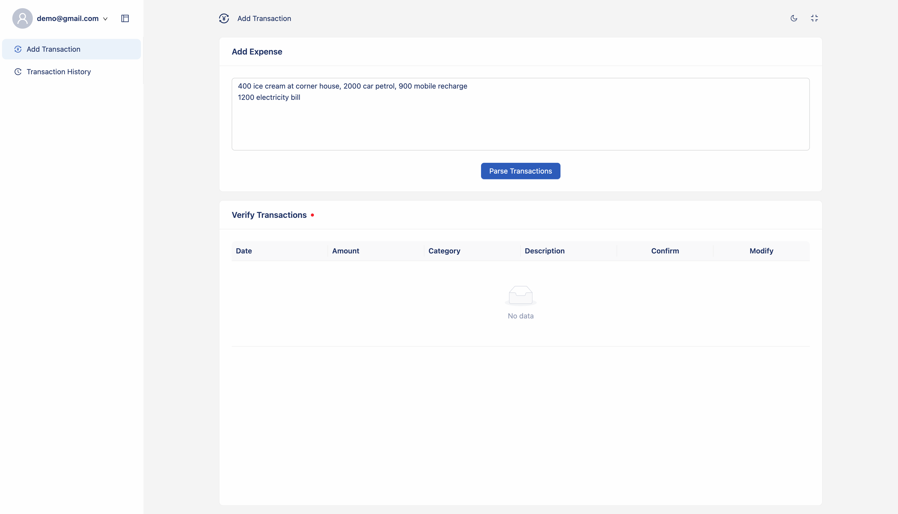
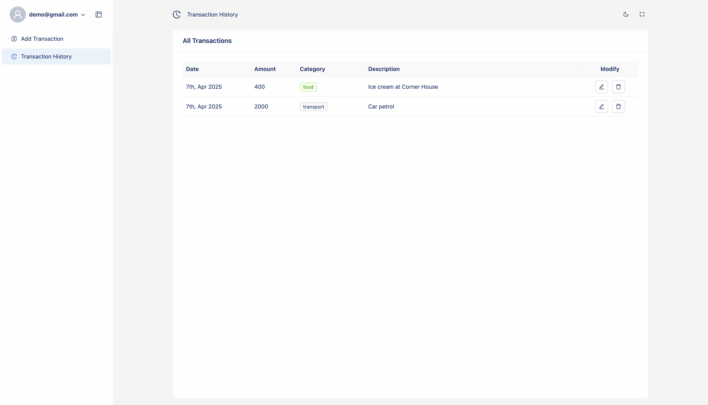
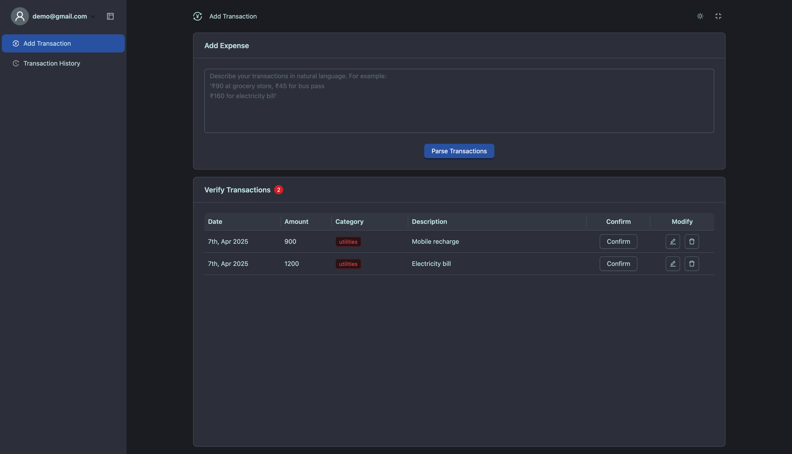

# Khajanchi - Simple Expense Tracker

A simple expense tracker inspired by [Gullak](https://github.com/mr-karan/gullak).

Enter your expenses in natural language, and let AI handle parsing and categorizing your transactions.






> **Note:** This application is currently under active development.

## Development Setup

### 1. Clone the Repository

```bash
git clone https://github.com/GnaneshPuttaswamy/khajanchi
cd khajanchi
```

### 2. Set Up Environment Variables

- **Backend:** Copy `packages/backend/.env.example` to `packages/backend/.env`.
- **Frontend:** Copy `packages/frontend/.env.example` to `packages/frontend/.env`.

Below are the required environment variables along with their default values. `OPENAI_API_KEY` is mandatory for parsing functionality. Other variables have default values but can be customized as needed.

```env
# Backend
DB_USERNAME=root
DB_PASSWORD=mydbpwd
DB_DATABASE=khajanchi
DB_HOST=db
DB_DIALECT=mysql
DB_PORT=3306
OPENAI_API_KEY=your_openai_key
JWT_SECRET=your_jwt_secret

# Frontend
VITE_API_URL=http://localhost:9000/api/v1
```

### 3. Start Services with Docker Compose

To start both backend and frontend:

```bash
docker compose up
```

This command performs the following:

- Starts a MySQL database on port `3306`
- Starts the backend server on port `9000`
- Starts the frontend development server on port `5173`
- Performs database migrations and seeds initial data

### 4. Access the Application

- **Frontend:** [http://localhost:5173](http://localhost:5173)
- **Backend API:** [http://localhost:9000/api/v1](http://localhost:9000/api/v1)
